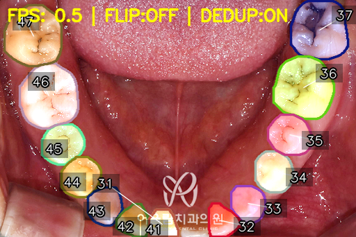
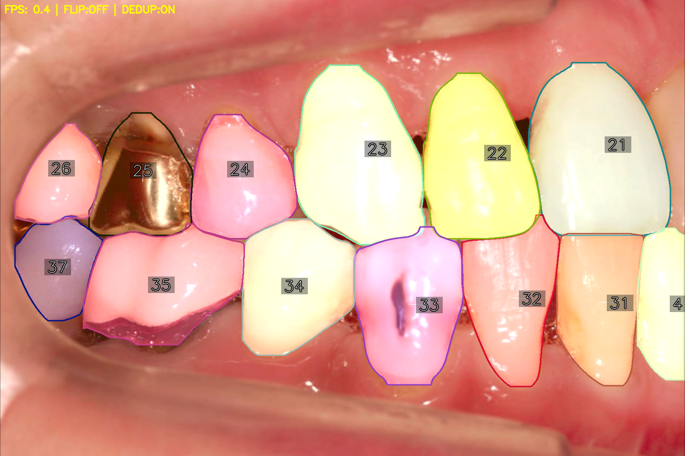
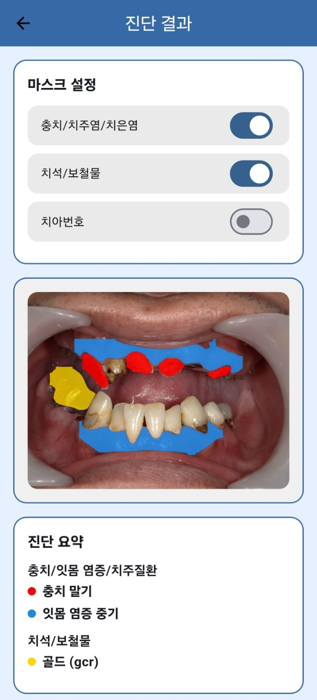
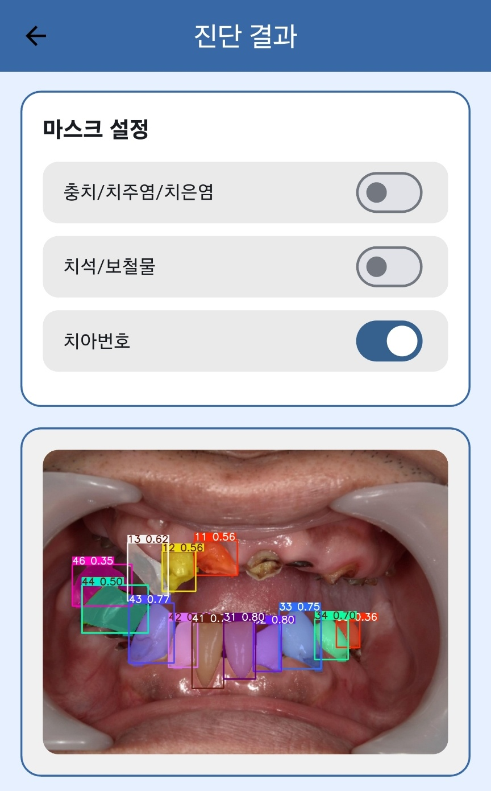
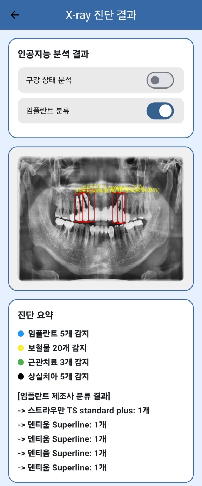
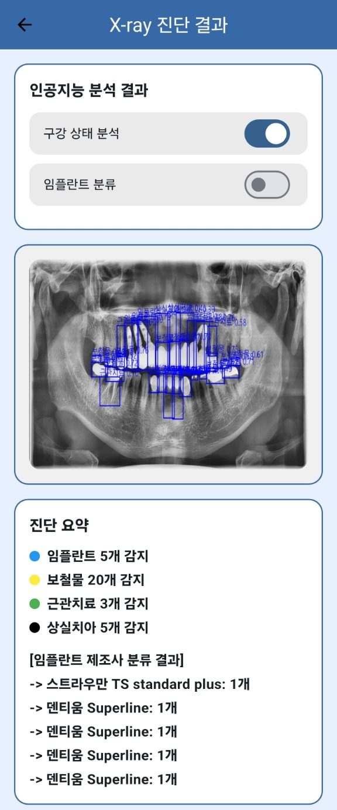

# 🤖 AI 모델 결과 모음 (AI Model Results)

이 문서는 ToothAI 프로젝트에서 개발된 AI 모델들의 **출력 예시 이미지**를 모아 정리한 문서입니다.  

---

## 1️⃣ 실시간 탐지 & 세그멘테이션 (Real-time Demo)

| 실시간 탐지 (Detection) | 실시간 Segmentation |
|---|---|
|  |  |

---

## 2️⃣ 치아 번호 분할 (Tooth Numbering, FDI 체계)

| Tooth Numbering 1 | Tooth Numbering 2 |
|---|---|
|  |  |

---

## 3️⃣ 앱 업로드 결과 (RGB 이미지 기반)

| Segmentation | Tooth Numbering |
|---|---|
|  |  |

---

## 4️⃣ X-ray 결과

| Classification (임플란트 분류) | Detection (상태 분석) |
|---|---|
|  |  |

---
